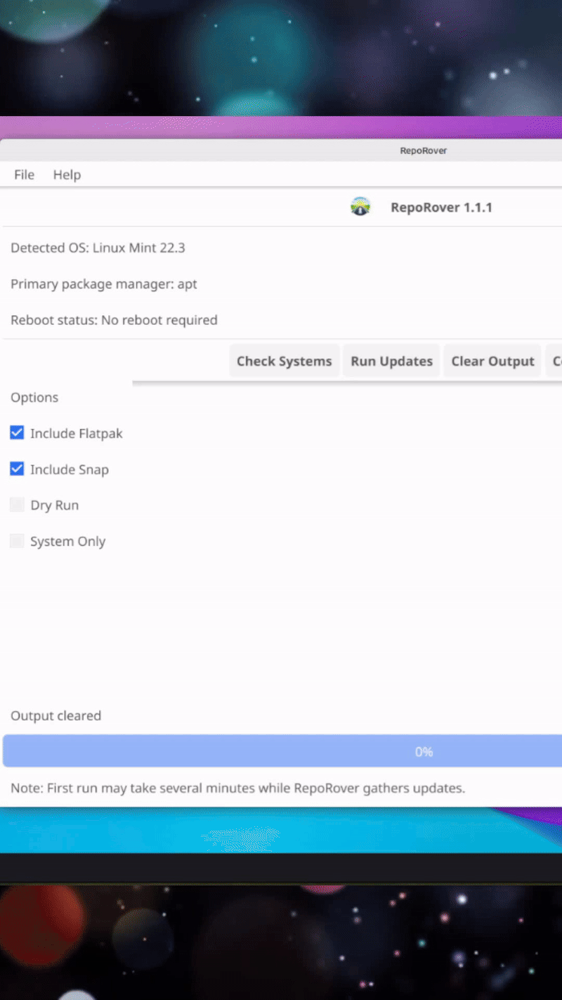

# RepoRover
“Update apt, snap, flatpak, pacman, zypper, and AUR — all in one click.”

<p align="center">
  <table>
    <tr>
      <td>
        
      </td>
    </tr>
  </table>
</p>

**RepoRover** is a graphical Linux system update utility that helps you update multiple package managers from one interface.

It detects your Linux distribution and installed package managers, then runs the appropriate update workflow for your system.

## Latest Release

👉 **RepoRover v1.2.0 now available**  
Includes improved AUR helper handling and updated release packaging.

⭐ Featured on LinuxLinks: [Read the review](https://www.linuxlinks.com/reporover-universal-linux-package-updater/)


⭐ If you find RepoRover useful, consider starring the project.

---

## Overview

RepoRover is designed for Linux users who want a simpler way to keep their systems updated without memorizing package manager commands.

Instead of manually running update commands, RepoRover provides a clean graphical interface that:

- detects your Linux distribution
- detects installed package managers
- runs the appropriate update commands for your system
- securely requests administrator privileges using **pkexec**

RepoRover is distributed as a **portable AppImage**, so it can run on many Linux systems without a traditional installer.

---

## Features

- Simple graphical interface for Linux system updates
- Automatically detects Linux distribution
- Automatically detects installed package managers
- Supports:
  - `apt`
  - `snap`
  - `flatpak`
  - `zypper`
  - `pacman`
  - AUR helpers: `yay` and `paru`
- Improved AUR helper handling in **v1.2.0**
- Secure privilege escalation using **pkexec**
- Portable **AppImage** distribution
- Optional install and uninstall scripts
- No traditional system-wide installation required

---

## Supported Distributions

RepoRover currently supports:

- Ubuntu
- Debian
- Linux Mint
- Fedora
- Arch Linux
- openSUSE Tumbleweed
- CachyOS

Support for additional distributions may be added in future releases.

---

## Screenshots

<p align="center">
  <b>🧭 Main Dashboard</b><br>
  
</p>

<p align="center">
  <b>🔍 Distro Discovery</b><br>
  
</p>

<p align="center">
  <b>🔐 Sudo Permission Prompt</b><br>
  
</p>

<p align="center">
  <b>📊 Results View</b><br>
  
</p>

---

## Homepage

[bytesbreadbbq.com/reporover](https://bytesbreadbbq.com/reporover/)

---

## Source Code

[github.com/RossContino1/RepoRover](https://github.com/RossContino1/RepoRover)

---

## Requirements

RepoRover requires the following components.

### pkexec (PolicyKit)

Used to securely request administrator privileges.

**Fedora**
```bash
sudo dnf install polkit
