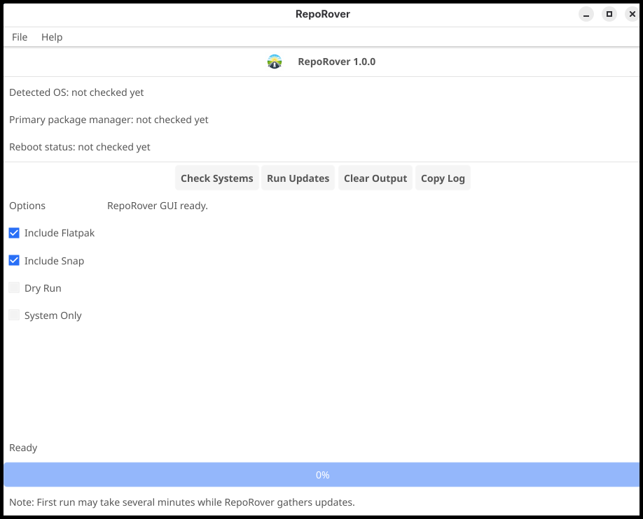
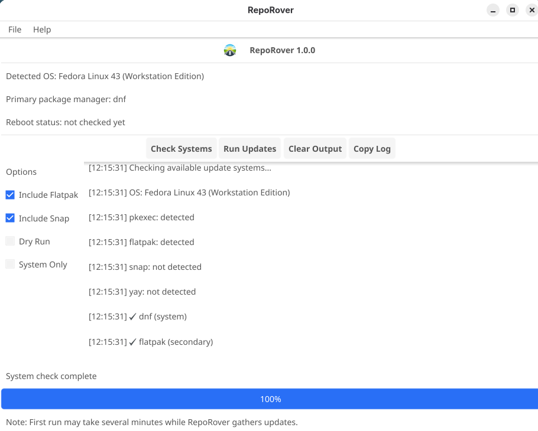
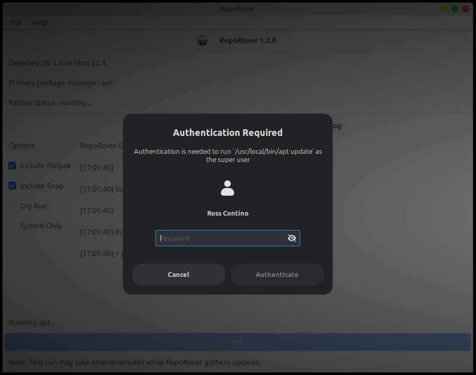
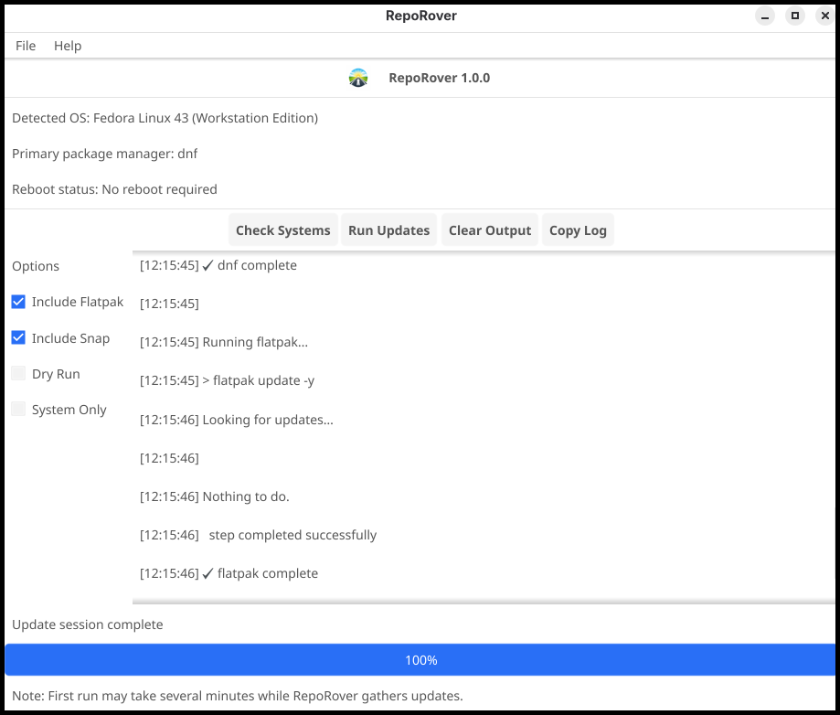

# RepoRover – Linux System Update Utility

⭐ If you find RepoRover useful, consider starring the project!

⭐ Featured on LinuxLinks: https://www.linuxlinks.com/reporover-universal-linux-package-updater/
---

## Overview

RepoRover is a simple graphical Linux system update utility.

Instead of remembering package manager commands, RepoRover provides a clean graphical interface that detects your Linux distribution and runs the appropriate update commands automatically.

The program uses native package managers and requests administrator privileges securely using **pkexec**.

RepoRover is distributed as a **portable AppImage**, allowing it to run on most Linux systems without requiring a traditional installation.

---
## 📸 Screenshots

  <b>🧭 Main Dashboard</b> 
  

  <b>🔍 Distro Discovery</b> 
  

  <b>🔍 Sudo Permission Prompt</b> 
  

  <b>📊 Results View</b> 
  

---

## Homepage

https://bytesbreadbbq.com/reporover/

---

## Source Code

https://github.com/RossContino1/RepoRover

---

## Features

• Simple graphical interface for system updates  
• Automatically detects Linux distribution  
• Uses native package managers  
• Secure privilege escalation using **pkexec**  
• Portable **AppImage** distribution  
• Optional install and uninstall scripts  
• No system-wide installation required  

---

## Supported Distributions

RepoRover currently supports:

- Ubuntu
- Debian
- Linux Mint
- Fedora
- Arch Linux
- openSUSE Tumbleweed
- CachyOS

Support for additional distributions may be added in future releases.

---

## Requirements

RepoRover requires the following components:

### pkexec (PolicyKit)

Used to securely request administrator privileges.

Install examples:

**Fedora**
sudo dnf install polkit

**Debian / Ubuntu**
sudo apt install policykit-1

---

### FUSE (required for AppImage)

Most Linux distributions already include FUSE.

Example installations:

**Fedora**
sudo dnf install fuse

**Debian / Ubuntu**
sudo apt install fuse

---
Security & Transparency

RepoRover does not download or install software itself.

It simply detects your Linux distribution and runs the standard package manager update command already used by your system.

Examples:

Distribution	Command RepoRover Runs
Ubuntu / Debian / Mint	apt update && apt upgrade
Fedora	dnf upgrade --refresh
Arch	pacman -Syu
openSUSE	zypper update

RepoRover is:

open source

written in Go

built with Fyne

distributed as an AppImage

You can inspect the source code here:

https://github.com/RossContino1/RepoRover
---

## Installation

RepoRover installs to the user's home directory and does not require administrator privileges.

Installed locations:
~/.local/bin/RepoRover.AppImage
~/.local/share/applications/com.bytesbreadbbq.reporover.desktop
~/.local/share/icons/hicolor/256x256/apps/reporover.png

### Install Steps

Open a terminal in the folder containing the files.

Make the installer executable:
chmod +x install.sh

Run the installer:
./install.sh

After installation, RepoRover will appear in your desktop environment's application menu.

---

## Running RepoRover

Launch RepoRover from your desktop application menu.

When an operation requires administrator privileges, the system will prompt for authentication using **pkexec**.

---

## First Run Behavior

When RepoRover is run on a system that has not been updated recently, the update process may take longer than usual.

During this time, the application may appear to pause or remain on the update screen. This is normal while the system gathers package information and checks for available updates.

Please allow the process to complete. Large update operations may take several minutes depending on the system and internet connection.

---

## Uninstall

To remove RepoRover:
chmod +x uninstall.sh
./uninstall.sh

This removes the AppImage, launcher, and icon.

---

## Legacy Installations

Older versions of SysUpdate installed files into:
/usr/local

If a legacy installation is detected, the install or uninstall script may offer to remove it. Administrator permission is required.

---

## Support / Issues

For bug reports or feature requests, please open an issue on GitHub:

https://github.com/RossContino1/RepoRover/issues

---

## More Projects from Bytes, Bread, and Barbecue

Check out other projects from this developer:

**Leonardo – Linux Media Conversion Application**

https://github.com/RossContino1/Leonardo
https://bytesbreadbbq.com/Leonardo

A fast and simple graphical front-end for FFmpeg designed for modern Linux systems.

---

## ☕ Support RepoRover

RepoRover is free to use. If it saves you time (or brisket), consider supporting development:

Your support helps.

## License

This project is licensed under the **MIT License**.

---

## Bytes, Bread, and Barbecue

At **Bytes, Bread, and Barbecue**, we like our code crispy and our software smokin’ hot.
